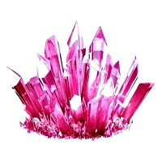
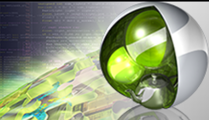

# 

> Crystal - A `modern`, `fashionable`, `high-quality` 3D volume rendering tool for medical images

>  The rendering results above were generated by my another project - a 'real-time', 'realistic' volume rendering engine. Realistic rendering will be a very important part of this project. 

---
#  Build this project

## Computer hardware and software configuration

|  Device   |  Minimum configuration | Recommended settings ((equal to or greater than)) |
|  ----  | ----  | ----  |
| System  | Windows 10 | Windows 10/11 |
| CPU RAM | 16GB | 32GB |
| GPU  | Nvidia RTX 2060 | Nvidia RTX 4070 |
| GPU VRAM | - | - |

|  Software   |  Minimum version | Recommended settings ((equal to or greater than)) |
|  ----  | ----  | ----  |
| Visual Studio | 2019 | 2019 |
| OpenGL | version 4.3 | - |

## Dependent third-party libraries

Qt, Cuda and Optix need to be installed by users, and other libraries will be loaded during the repository clone and compiled into the project.

### 

> **Qt** version (equal to or greater than) 6.0   
> https://www.qt.io/product

### 

> **Nvidia Cuda** version (equal to or greater than) 11.0   
> https://developer.nvidia.com/cuda-toolkit

### 

> **Nvidia Optix7** version (equal to or greater than) 7.4   
> https://developer.nvidia.com/rtx/ray-tracing/optix

### 

> **OpenEXR**
> https://openexr.com/en/latest/

## Clone and Build the project

Using GitBash, enter:

> - git clone --recursive git@github.com:dezeming/Crystal.git

If the project has already been cloned, but there are no clone sub modules, enter the project root directory in GitBash and call:

> - git submodule update --init --recursive

## Corresponding CMake path that needs to be modified (in CMakeLists.txt)

> **Qt directory**
> - set(Qt_DIR "D:/DevTools/Qt/6.2.4/msvc2019_64/" CACHE PATH "qt6 cmake dir")

> **Optix directory**
> - set(Optix_SDK "C:/ProgramData/NVIDIA Corporation/OptiX SDK 7.6.0/")

## Some Bugs need to be solved

> - Compilation will generate Crystal.lib, which needs to be removed in order to generate a new executable program in Visual Studio.
> - When the executable program is not called in Visual Studio, colored fonts will not be output, but chaotic characters will be output.

---
#  Supported Features

## 3D medical images Cinematic rendering

> Utilize advanced visualization techniques to process medical image data, and apply physically-based rendering techniques to achieve realistic rendering effects.

## Advanced Visualization Tools

> Implement multiple visualization processing algorithms and enable interactive operation of said algorithms.

## Support for multiple light sources

> Provide support for multiple light sources, including point light, surface light, directional light, and high dynamic range environment mapping, to illuminate medical 3D data.

## Real time denoising

> Provide real-time denoising capabilities for realistic rendering, with the intention of achieving high-quality rendering results in interaction.

# Design description

## Parser XML file

Scene.xml file includes 4 components: Camera, Film, Visualizer, SceneGeometry, DataMapper. The scene file is used to intialize classes in 'ScenePreset.h'.

Scene.xml
> - Basic: CameraPreset, FilmPreset, VisualizerPreset

DataMapper.xml
> - DataMapper: STF_Preset

SceneGeometry.xml
> - Medical: MedicalVolumeDataPreset, MedicalMeshDataPreset
> - OtherGemoetry: EnvironmentMeshPreset
> - Light: PointLightPreset, QuadAreaLightPreset, HdrEnvironmentLightPreset
> - PointLightPreset

## Data Mapper

Our renderer supports rendering both surface model and volume simultaneously.

DataMapper is designed to map the voxel value into material properties. The current design of DataMapper will support two modes: one is to map scalar data, which is the scalar transfer function; Another method of mapping vector data, such as the volume formed by stacking RGB images, is the vector transfer function. DataMapper is only associated with volumes in the scene and is not related to other geometries (such as meshes).

